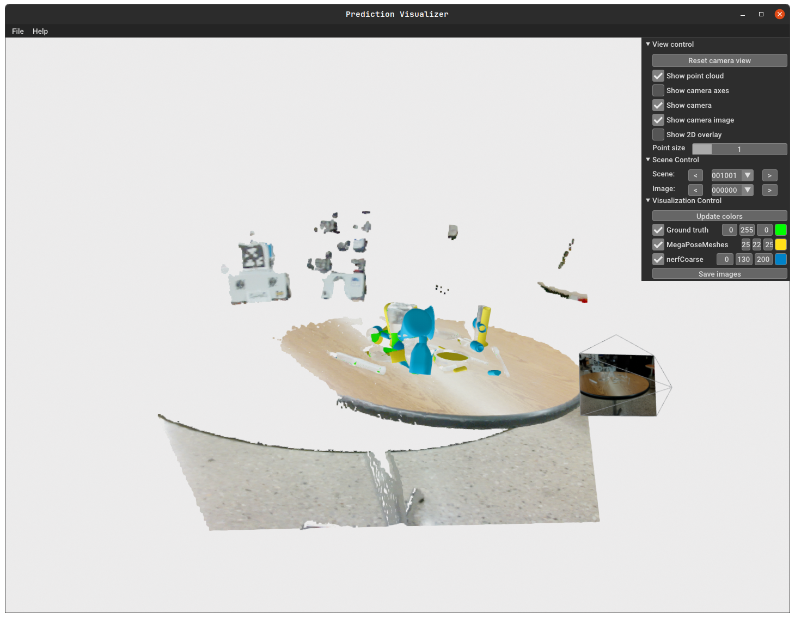
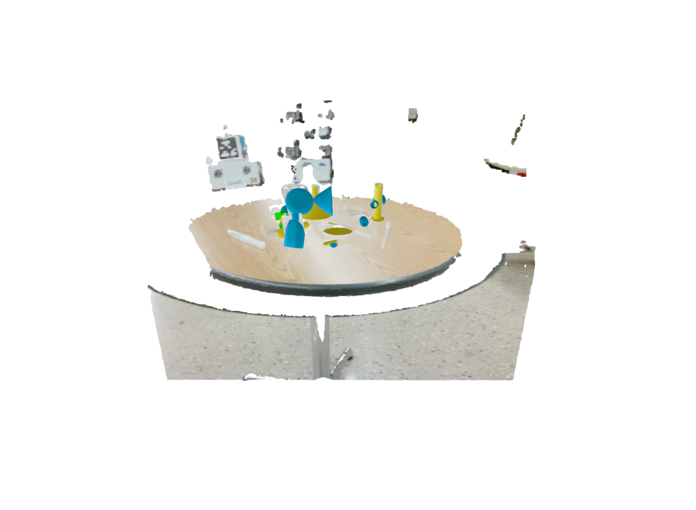
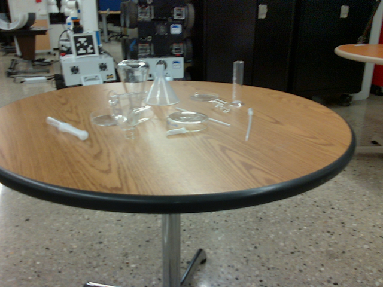
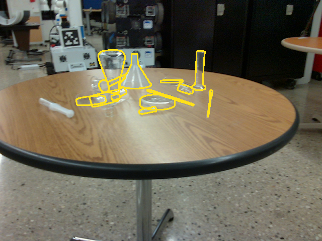
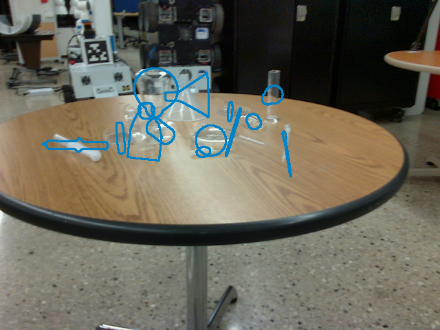
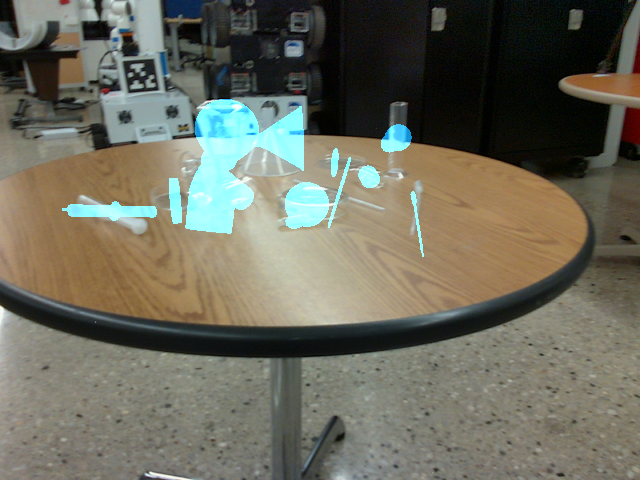

# BOP_3D_visualizer
[](https://opensource.org/licenses/MIT)

GUI application for visualizing the [BOP challenge](https://bop.felk.cvut.cz/home/) 6D object pose estimation results. 


Features:
- **RGB point cloud** visualization if depth is provided.
- **Ground truth** object poses visualization if it is provided. 
- **Predictions poses** visualization, support for multiple methods comparison. 
- **2D image projection** of the predicted object poses into the image and possibility to save the them.
- **Color selection** for the method predictions by the user. 
- **Camera pose visualization** - basic camera frame visualization as OpenCV coordinate system.
<!-- TODO: COMBINE IMAGES AND INPUT AS ONE -->

Be mindfull that the application is still in development and some features might not work as expected.
Also the application shows the whole split, so if showcasing the result for example LM-O datset, the application does not consirder the `test_targets_bop19.json` or `test_targets_bop24.json` file, which is used for the evaluation of the results in BOP challenge, wher only certain images are used (3, 7, ...) and showcases results on all of the images.
## Exported visualization example
| | |
|:-------------------------:|:-------------------------:|
|  3D view image |   Inference Image|
| First Method Contour Highlight |  First Method Mask Overlay|
| Second Method Contour Highlight  |   Second Method Mask Overlay|


## Data format
The application expects the format same as the [BOP challenge for 6D pose estimation](https://bop.felk.cvut.cz/challenges/bop-challenge-2019/), that is a csv file named `METHOD_DATASET-test.csv` with the following columns:
- scene_id -> The scene id of the dataset.
- im_id -> The image id of the image in the scene.
- obj_id -> The object id of the object in the image.
- score -> The score of the object detection(Not used in this application).
- R -> 3x3 rotation matrix whose elements are saved row-wise and separated by a white space  (i.e. r11 r12 r13 r21 r22 r23 r31 r32 r33, where rij is an element from the i-th row and the j-th column of the matrix).
- t -> x1 translation vector (in mm) whose elements are separated by a white space (i.e. t1 t2 t3).
- time -> Inference time of all objects poses for the whole image (Not used in this application).

## Usage
1. Clone the repository.

2. Install the required packages:
```bash
    TODO: Open3d pandas numpy opencv-python and some others
```

4. Setup the config path as seen in the [config.py](config/example_config.json) file.
- `split_scene_path` - Path to the dataset folder and its split.
- `models_path` - Path to the 3D models of the objects whic are used for the visualization.
- `csv_paths` - List of the paths to the csv files with the predictions for possible comparison of multiple methods.
- `saving_path` - Path to the folder where the images with the 2D projections will be saved.

5. Run the application:
```bash
    python main.py -c config/example_config.json
```
Will call 2 subprocesses for the GUI/3D visualization and the 2D visualization service. Replace the `config/example_config.json` with the path to your config file.

# TODO: Features to add
- [X] Add the switching between rgb and gray. This is required due to some of the datasets being in grayscale.
- [X] Add config loading in the main.py and its usege in the application.
- [X] Add the camera pose visualization.
- [ ] Make more robust for xyzibd where multiple cameras are present in the scene.
- [ ] Finish the documentation and type hints.
